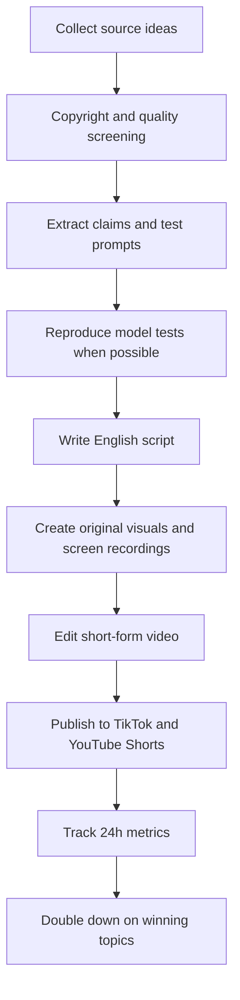

# Vancine Overseas Video Growth Workflow

目标：用 TikTok、YouTube Shorts、YouTube 长视频、X 等海外平台，围绕“海外开发者如何访问中国顶尖 AI 模型”“中国最新模型实测”“中国模型成本和能力优势”等主题快速获取流量，并将流量导入 vancine.com。

重要原则：不要未经授权整段搬运他人视频、去水印或规避版权检测。国内视频可以作为信息源和选题来源，但最终内容应做成英文二创解读、自测复现、评论分析或新闻式整理，并保留来源记录。

## 1. 增长定位

核心卖点：

- One API for top Chinese AI models.
- Access the latest Chinese text, image, video, music, and multimodal models from one place.
- Lower integration friction for global developers who want to test Chinese AI models.

目标用户：

- Indie hackers
- AI app builders
- SaaS founders
- API developers
- AI automation creators
- 海外关注中国 AI 模型的技术用户

主引流动作：

- TikTok / Shorts 看完视频
- 点击 profile link
- 进入 vancine.com
- 领取受控试用额度或注册 API key
- 查看 docs 并完成第一次 API call

建议落地页 CTA：

```text
Access the latest Chinese AI models through one unified API.
Start testing with controlled trial credits.
```

## 2. 每日工作流总览



## 3. 选题来源

每天收集 10-20 个候选内容，只保留 3-5 个进入制作。

优先来源：

- Bilibili AI 模型评测
- 小红书 AI 工具分享
- 抖音 AI 工具/模型测试
- 知乎模型讨论
- 微信公众号技术测评
- 国内模型官方更新
- Hugging Face trending
- X 上的 AI model benchmark 讨论
- Reddit r/LocalLLaMA、r/artificial、r/OpenAI 等话题

优先选题类型：

- 中国顶尖模型能力实测
- 中国模型 vs 海外主流模型公开表现的解读
- 中文写作、翻译、代码能力对比
- 多模态生成：图片、视频、音乐
- API 调用成本对比
- 同一个 prompt 多模型输出
- 海外开发者不了解的中国模型
- 新模型发布后的 24 小时快评

放弃选题：

- 来源不清晰
- 只有情绪，没有可验证结论
- 涉及影视、音乐、综艺等高版权风险素材
- 需要大段引用原视频才能讲明白
- 标题党但无法复测

## 4. 素材合规分级

每条来源先分级，再决定使用方式。

### A 档：可授权使用

条件：

- 原作者明确授权
- 官方素材包允许引用
- CC / 开放许可，且满足署名要求

使用方式：

- 可短引用片段
- 必须标注 source
- 不要覆盖水印或冒充原创

### B 档：无授权但可作为信息源

条件：

- 无明确授权
- 内容结论有参考价值
- 可以自己复测或重做图表

使用方式：

- 不直接搬运原视频画面
- 用英文脚本重写
- 自己录屏、做表格、做评分卡
- 结论处注明 “based on public discussion / source linked in description”

### C 档：不使用

条件：

- 来源混乱
- 包含大量第三方版权内容
- 涉及隐私、攻击、误导
- 需要去水印或规避平台检测

处理方式：

- 放弃

## 5. 内容制作 SOP

### Step 1: 建立选题卡

每个候选内容记录：

```text
Topic:
Original source URL:
Source creator / publication:
Source platform:
Models mentioned:
Key claim:
Can we reproduce it? Yes / No
Permission level: A / B / C
Risk notes:
Suggested hook:
Vancine angle:
```

### Step 2: 提取可复测 prompt

尽量把视频里的对比变成可复测任务：

```text
Model A:
Model B:
Model C:
Prompt:
Task type: writing / coding / translation / image / video / music / reasoning
Evaluation criteria:
Expected output format:
Cost estimate:
Latency estimate:
```

### Step 3: 用 Vancine 复现

优先录制自己的测试过程：

- Vancine dashboard
- API key creation
- API docs
- curl request
- response output
- 多模型结果对比
- 价格/速度表格

视频中可以强调：

```text
I tested these models through one unified API on Vancine.
```

### Step 4: 写英文短视频脚本

短视频结构：

```text
0-3s Hook
3-8s What we tested
8-25s Results
25-35s Why it matters
35-45s CTA
```

推荐 CTA：

```text
You can test multiple AI models through one API at vancine.com.
```

### Step 5: 剪辑模板

固定画面结构：

- 顶部：强 hook 标题
- 左侧：模型 A 输出
- 右侧：模型 B / C 输出
- 中间：评分或结论
- 底部：`Test more models at vancine.com`
- 结尾 2 秒：Vancine logo + `One API, Infinite Creativity`

视觉风格：

- 使用 Vancine 紫色、青色、粉色渐变
- 使用已生成的 YouTube banner/avatar/watermark
- 少用复杂动画，优先保证信息密度
- 字体大，移动端可读

## 6. 短视频脚本模板

### 模板 A：国产模型追赶

```text
Chinese AI models are catching up fast.

I tested one of the latest Chinese AI models with a real developer prompt.

For Chinese writing, the result was surprisingly strong.
For cost and access, it is very interesting for builders.
For global developers, the biggest problem is usually integration.

If you want to test these models yourself, Vancine lets you call multiple AI models through one API.

Try it at vancine.com.
```

### 模板 B：成本对比

```text
Stop overpaying for AI APIs.

I ran the same task across several Chinese AI models.

The output quality was strong for this use case, and the cost difference between model choices was meaningful.

This is why developers should test multiple models before choosing one.

You can compare and call them through one API on Vancine.
```

### 模板 C：同一个 prompt 挑战

```text
One prompt. Multiple Chinese AI models.

I asked several Chinese AI models to solve the same task.

Here are the results.

Best reasoning: [model]
Best writing: [model]
Best cost: [model]
Best overall for builders: depends on your use case.

Vancine lets you test them all through one API.
```

### 模板 D：海外开发者不了解的国产模型

```text
Most developers outside China have never tested this AI model.

But it performs surprisingly well on Chinese writing, translation, and some multimodal tasks.

The problem is access.

Vancine gives developers one API to test top Chinese AI models without managing multiple integrations.
```

## 7. 标题库

TikTok / Shorts 标题：

```text
Chinese AI Models Are Catching Up Fast
Top Chinese AI Models Tested In English
This Chinese AI Model Is Shockingly Cheap
I Tested 4 AI Models With The Same Prompt
Stop Ignoring Chinese AI Models
One API To Access Top Chinese AI Models
Chinese AI Models Are Catching Up Fast
The Latest Chinese AI Models Are Better Than You Think
The Cheapest AI Model Was Not What I Expected
I Compared AI Models For Developers
```

YouTube 长视频标题：

```text
I Tested The Latest Chinese AI Models For Global Developers
Best Chinese AI API For Developers?
Are Chinese AI Models Good Enough For Global Developers?
Chinese AI API Cost Comparison: Which Model Should Builders Use?
```

## 8. 发布节奏

### 第一周：测试期

每天发布：

- TikTok: 3 条
- YouTube Shorts: 3 条
- X: 2-3 条图文或短视频复用

每晚复盘：

- 3 秒留存
- 完播率
- 点赞率
- 评论关键词
- profile clicks
- vancine.com 注册数
- API key 创建数

### 第二周：放大期

选择第一周表现最好的 2 个主题，批量做变体：

- 换 hook
- 换模型组合
- 换 prompt 类型
- 换结论角度
- 做 3-6 分钟 YouTube 长视频

### 第三周：社区分发

把最佳视频改成深度图文：

- X thread
- Reddit 讨论帖
- Hacker News Show HN
- Indie Hackers post
- Product Hunt 预热

社区帖不要硬广，先给结论和数据，再自然说明：

```text
I used Vancine to run the same prompts across multiple models through one API.
```

## 9. 数据表字段

建议用 Notion / Airtable / Google Sheet。

```text
Date
Topic
Source URL
Permission level
Models compared
Prompt
Script version
Video file
TikTok URL
YouTube Shorts URL
X URL
Views 3h
Views 24h
Completion rate
Profile clicks
Website clicks
Signups
API keys created
First API calls
Notes
Next action
```

## 10. 关键指标

短视频前期不要只看播放量，要看能不能带来开发者。

优先级：

1. Website clicks
2. Signups
3. API keys created
4. First API calls
5. 评论里是否有人问 price / docs / API
6. 完播率
7. 播放量

判断标准：

- 播放高、点击低：内容太泛娱乐，需要更开发者化
- 播放低、点击高：题材精准，可以继续做
- 评论问模型和价格：值得做长视频和文档页
- 注册多、API call 少：落地页或 docs 需要优化

## 11. 账号资料建议

Bio:

```text
One API for top Chinese AI models: text, image, video, music, and more.
Test the latest Chinese AI models at vancine.com
```

固定链接：

```text
https://vancine.com?utm_source=tiktok_profile
https://vancine.com?utm_source=youtube_profile
```

置顶视频：

1. What is Vancine?
2. Latest Chinese AI models tested
3. How to call multiple AI models with one API

## 12. 制作资产

已生成资产可用于账号搭建和视频片尾：

- `output/imagegen/vancine-youtube-banner-2560x1440.png`
- `output/imagegen/vancine-youtube-avatar-800x800.png`
- `output/imagegen/vancine-youtube-watermark-150x150.png`

建议再补充：

- 9:16 竖屏视频背景模板
- 评分卡模板
- 模型对比表模板
- Vancine 片尾 2 秒模板
- API curl 录屏模板

## 13. 风险控制清单

发布前检查：

- 是否整段使用了他人视频？如果是，停止
- 是否去掉或遮盖了原作者水印？如果是，停止
- 是否夸大模型能力？如果是，改成可验证说法
- 是否标注了引用来源？如果引用了原结论，需要标注
- 是否自己复测了？如果没有，避免说 “I tested”
- 是否含有误导性 AI 合成画面？如果有，按平台要求标注
- 是否能让用户一眼知道 Vancine 是 API 平台？如果不能，补 CTA

## 14. 试用额度控制策略

注册送额度建议从“金额型补贴”改成“任务型体验”，降低真实模型厂商成本被刷爆的风险。

推荐默认方案：

- 新用户注册送 `0.10-0.30 USD` 等值额度，而不是 `1 USD`
- 只允许试用低成本模型或指定模型池
- 每个账号每日请求次数限制，例如 `20-50` 次
- 每次请求限制最大 token / 最大图片数量 / 最大视频时长
- 需要邮箱验证后才能领取
- 同 IP / 同设备 / 同支付指纹 / 同邮箱域名做风控
- 高频失败、批量注册、异常消耗自动冻结试用额度

更适合海外推广的说法：

```text
Start with free trial credits.
Test top Chinese AI models before scaling.
```

不建议直接宣传：

```text
Get $1 free credits.
```

原因：真实上游模型有成本，`$1` 对正常开发者不算大，但对批量薅羊毛非常有吸引力。营销上可以说 “free trial credits”，后台实际额度可以按渠道、模型、风控等级动态发放。

渠道额度建议：

- TikTok 普通流量：`0.10 USD`
- YouTube Shorts 普通流量：`0.10 USD`
- Product Hunt / Hacker News：`0.30 USD`
- KOL 专属邀请码：按合作质量单独配置
- 已验证公司邮箱：可人工或半自动提高额度

转化设计：

- 注册后给试用额度
- 完成第一个 API call 后提示充值
- 额度用完后展示成本对比和推荐套餐
- 对高质量用户提供人工增加额度入口

## 15. 第一批 10 个选题

1. Latest Chinese AI models: same writing prompt
2. Which AI model is cheapest for app builders?
3. Chinese AI models for Chinese writing and translation
4. One API endpoint to call multiple AI models
5. Can a cheaper Chinese model handle simple production tasks?
6. Image generation model cost comparison
7. Video generation AI is getting cheaper
8. Best AI model for coding: quick test
9. Why developers should not rely on one AI provider
10. How to test top Chinese AI models in one place

## 16. 下一步

需要确认的口径：

- Vancine 试用额度到底给多少，以及如何防止被刷
- 要主推哪些国产模型
- 是否允许公开展示后台和 API key 流程
- 是否要建立 Discord / Telegram 社群
- 是否准备做 affiliate / creator coupon

确认后可以继续产出：

- 30 条英文短视频脚本
- 10 条 YouTube 长视频大纲
- TikTok / YouTube 账号简介和置顶文案
- 剪辑模板分镜
- Notion/Airtable 运营表格模板
